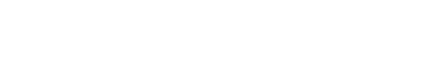

<!-- Changelog
2.0.1 (2026-06-15): Widget de confirmación de branding — agregado assets/branding-prompt.html con isotipo azul, botones Sí/No via sendPrompt(), e instrucciones en SKILL.md para mostrarlo cuando la intención del usuario no sea explícita.
2.0.0 (2026-06-15): Reemplazo completo basado en el ProContacto Design System oficial. Cambios clave: (1) fondo oscuro #0B0C0E es el canvas de marca por defecto — el mundo de marca es dark canvas + electric blue + violet glow; el modo light existe para formatos operativos (DOCX, propuestas) pero no es la identidad; (2) paleta actualizada desde Figma — escalas completas de azul (100-900) y violeta (100-900), tokens semánticos de superficie, texto y estado; gradientes glow y radial; (3) 8 activos de logo canónicos incluyendo variantes negras/azules oficiales: isotipo_black.svg, isotipo_blue.svg, logo_primario_black.svg; (4) tokens de spacing (--s-0 a --s-10, grid 8pt/4px), radii (--r-xs a --r-pill), sombras y movimiento (easing, duración); (5) patrón de cards: superficie #1F1F1F + borde rgba(255,255,255,0.10) — prohibido "card con borde de color lateral"; (6) iconografía: Lucide CDN; (7) colores de status actualizados (Success #009060, Info #0070DD, Error #D21E41, Warning #DF4D03). Capa verbal, canales y ortografía sin cambios.
1.3.0 (2026-05-14): Agregada sección "Ortografía y codificación de texto".
1.2.1 (2026-05-11): Hotfix de runtime — instrucciones de acceso a SVGs desde Claude.
1.2.0 (2026-05-08): Bloqueo del logo a SVGs canónicos.
1.1.0 (2026-04-27): Incorporación de la arquitectura verbal de marca.
1.0.0 (2026-04-25): Primera versión formal.
-->

# ProContacto Design System — Guía maestra

Esta skill garantiza que todo documento, artefacto o pieza de comunicación respete el Design System de ProContacto: la **capa visual** (canvas oscuro, tokens de color, tipografía, logo, spacing, motion), la **capa verbal** (arquitectura de marca: qué texto usar en cada canal) y la **capa ortográfica** (tildes, ñ, UTF-8).

Lee este archivo completo antes de generar cualquier output. Para detalle de cada bloque, consulta `references/`.

## Cuándo aplicar estas reglas

Aplica estas directrices a **todo** output: presentaciones (PPTX), documentos (DOCX), PDFs, spreadsheets (XLSX), HTML artifacts, React components, dashboards, posts de LinkedIn, copy para sitio web, AppExchange, firmas de email, materiales para eventos, y cualquier pieza que el usuario vaya a ver, compartir o publicar.

## Cuándo NO aplicar estas reglas

Si el usuario indica explícitamente que no quiere la marca de ProContacto, respeta esa decisión. Frases que desactivan el skill:

- "sin branding", "sin marca", "sin marca PC", "sin la marca de ProContacto"
- "para un cliente", "con la marca del cliente", "usar la identidad del cliente"
- "estilo neutro", "genérico", "sin identidad visual", "sin formato corporativo"
- "no uses los colores de ProContacto", "no apliques el manual de marca"

**Importante**: La sección "Ortografía y codificación de texto" **NO se desactiva** con estas frases. La ortografía correcta aplica siempre.

## Widget de confirmación de branding

Cuando la intención del usuario respecto al branding **no sea explícita**, mostrar el widget de confirmación antes de comenzar la tarea. El HTML está guardado en `assets/branding-prompt.html` para que siempre se vea igual.

**Flujo obligatorio**:

1. Leer el archivo del widget:
   ```
   Read("<SKILL_BASE_DIR>/assets/branding-prompt.html")
   ```
2. Mostrar el widget con la herramienta `mcp__visualize__show_widget`:
   - `title`: `"branding_procontacto_confirm"`
   - `loading_messages`: `["Preparando confirmación de branding..."]`
   - `widget_code`: el contenido completo del archivo leído
3. Esperar la respuesta del usuario:
   - **"Sí, aplicar el branding de ProContacto"** → aplicar el Design System completo
   - **"No, continuar sin branding de ProContacto"** → tratar como "sin marca PC" — solo aplica la capa ortográfica

**Cuándo omitir el widget** (intención ya clara, ir directo):

| Caso | Acción |
|------|--------|
| Usuario dice "aplica el branding", "usa los colores de ProContacto", "con la marca de PC" | Aplicar sin preguntar |
| Contexto evidente: "ármame el deck de ProContacto", "crea el PPTX con los colores" | Aplicar sin preguntar |
| Usuario dice "sin branding", "sin marca", "para un cliente", "estilo neutro" | No aplicar sin preguntar |
| Tarea puramente verbal o de texto (no genera artefacto visual) | No mostrar — no aplica |

## Voz y tono

ProContacto habla en **español de negocios LATAM**: directo, profesional, orientado a resultados. Sin buzzwords de relleno. Sin emoji. Sin exclamaciones salvo en claims de campaña deliberados.

- **Tú, no Usted** — moderno y directo: "tu negocio", "tu equipo"
- **Verbos en primera persona plural** — "Diseñamos…", "Implementamos…", "Acompañamos…"
- **El cliente es el protagonista**, nunca ProContacto
- **CTA conversacional**: "Hablemos de tu negocio" — nunca "Contáctanos" ni "Más información"
- **Outcome-led**: cada afirmación termina en resultado medible — "para que tus resultados sean medibles", "más ventas, más visibilidad, más eficiencia"

---

# Ortografía y codificación de texto

Esta capa es **innegociable** — aplica a **todo output en español** aunque el usuario pida "sin marca PC". Un documento de ProContacto con faltas de ortografía es un error grave.

## Las 3 reglas duras

### 1. Ortografía española estándar

Todo texto en español usa **ortografía estándar de la RAE**:

- **Tildes siempre**: gestión, también, tecnología, implementación, análisis, día, está, más, después, según, así, aquí, Bogotá, Medellín, México, Bahía Blanca, Córdoba
- **Ñ donde corresponda**: año, español, diseño, mañana, compañía
- **Signos de apertura**: `¿Cuándo arrancamos?`, `¡Bienvenido!`

Está **prohibido** entregar prosa "aplanada" aunque el input venga así:

| ❌ Incorrecto | ✅ Correcto |
|---|---|
| `Implementacion de la solucion tecnologica` | `Implementación de la solución tecnológica` |
| `Diseno de la arquitectura` | `Diseño de la arquitectura` |
| `Como podemos ayudarte?` | `¿Cómo podemos ayudarte?` |
| `Bahia Blanca, Argentina` | `Bahía Blanca, Argentina` |

**Excepciones legítimas**: API names de Salesforce (`Account_Extension__c`), URLs/slugs técnicos, nombres propios sin tilde por convención del titular, texto en inglés.

### 2. Codificación UTF-8 explícita en scripts

```python
# ✅ CORRECTO
with open(path, "w", encoding="utf-8") as f:
    f.write("Implementación, gestión, análisis")

import json
with open(path, "w", encoding="utf-8") as f:
    json.dump(data, f, ensure_ascii=False, indent=2)

# ❌ INCORRECTO — puede romper acentos según el locale del sistema
with open(path, "w") as f:
    f.write("Implementación")
```

Para HTML/React: incluir siempre `<meta charset="utf-8">`.

Librerías de documentos: python-docx, python-pptx y openpyxl manejan UTF-8 por default — pasar strings con tildes directamente.

### 3. Restaurar ortografía si el input viene degradado

Transcripts de Read.ai, OCR, emails mal codificados → **restaurar tildes antes de generar el output**, no propagar el texto degradado. Si el cliente lo va a leer, debe estar bien escrito.

**Checklist antes de entregar en español**: ¿todas las palabras que llevan tilde, la tienen? ¿Las ñ están donde corresponden? ¿Las preguntas llevan ¿ de apertura? ¿Si escribiste archivo desde Python, usaste `encoding="utf-8"`?

---

# Capa Visual

## La gran idea del mundo de marca

**ProContacto es un mundo oscuro**: deep dark canvas (`#0B0C0E`) + azul eléctrico (`#0062FF`) + violeta suave (`#8F7AFF`) con efecto glow. Este es el **canvas por defecto** de la marca. Las composiciones parten de una superficie oscura; el azul y el violeta aparecen como full-bleed en portadas, divisores de sección y CTAs.

**Proporciones por composición**: aprox. **60% oscuro · 25% azul · 10% blanco · 5% violeta**.

El modo claro (fondo blanco) existe para formatos operativos — DOCX, propuestas impresas, planillas — pero **no es la identidad de marca**. Si generas un HTML artifact, React component, deck o dashboard de ProContacto, arrancas con fondo `#0B0C0E`.

**No**: ilustraciones dibujadas a mano, texturas repetidas, texturas de papel o tela. La marca es digital-clean.

## Paleta de colores

Para la paleta completa con escalas 100–900, consulta `references/color-system.md`.

### Colores de marca

| Rol | Token | Hex | Uso |
|-----|-------|-----|-----|
| **Azul primario** | `--pc-blue-500` | `#0062FF` | CTAs, acentos, links, full-bleed de sección |
| **Violeta secundario** | `--pc-violet-500` | `#8F7AFF` | Complementario al azul — siempre paired, nunca solo |
| **Gradiente vertical** | `--pc-gradient` | `linear-gradient(180deg, #0062FF 0%, #8F7AFF 100%)` | **Solo fondos**. Portadas, CTA bands, hero. Nunca en logo ni en texto. |
| **Glow radial** | `--pc-gradient-glow` | `radial-gradient(ellipse 80% 50% at 50% 100%, rgba(0,98,255,0.55) 0%, rgba(143,122,255,0.25) 35%, rgba(11,12,14,0) 70%)` | Aurora azul→violeta desde abajo en portadas oscuras |
| **Canvas** | `--pc-bg-canvas` | `#0B0C0E` | Fondo principal de toda composición |

### Colores de estado

| Estado | Token | Base | Light |
|--------|-------|------|-------|
| Success | `--pc-success-500` | `#009060` | `#C1E7D5` |
| Information | `--pc-info-500` | `#0070DD` | `#99CCFF` |
| Error | `--pc-error-500` | `#D21E41` | `#FBCCD7` |
| Warning | `--pc-warning-500` | `#DF4D03` | `#FDCCB9` |

### Tokens semánticos — usar estos en UI, no los valores raw

| Token | Valor | Uso |
|-------|-------|-----|
| `--bg` | `#0B0C0E` | Fondo base |
| `--surface` | `#1F1F1F` | Cards, paneles |
| `--border` | `rgba(255,255,255,0.10)` | Bordes en superficies oscuras |
| `--border-strong` | `rgba(255,255,255,0.18)` | Bordes hover |
| `--fg` | `#FFFFFF` | Texto principal |
| `--fg-1` | `rgba(255,255,255,0.96)` | Texto alto énfasis |
| `--fg-2` | `rgba(255,255,255,0.72)` | Texto cuerpo |
| `--fg-3` | `rgba(255,255,255,0.52)` | Labels, secundario |
| `--fg-4` | `rgba(255,255,255,0.34)` | Footers, terciario |
| `--fg-on-blue` | `#FFFFFF` | Texto sobre fondo azul |
| `--fg-on-light` | `#0A0A19` | Texto sobre fondo claro |
| `--accent` | `#0062FF` | Acento primario |
| `--accent-2` | `#8F7AFF` | Acento secundario |
| `--link` | `#66ACFF` | Links sobre fondo oscuro |

## Tipografía

La única tipografía de ProContacto es **Open Sans**. Variable font (pesos 300–800).

| Nivel | Peso | Token | Uso |
|-------|------|-------|-----|
| Título / Display | ExtraBold 800 | `--w-extrabold` | H1, portadas, títulos de slide |
| Subtítulo | Light 300 | `--w-light` | H2, bajada — Light a escala es la firma visual de la marca |
| Cuerpo | Regular 400 | `--w-regular` | Párrafos |
| Destacado | Bold 700 | `--w-bold` | Palabras clave, énfasis inline |

El contraste **ExtraBold / Light** en headings de display es el movimiento visual más reconocible de la marca. **No sustituir** con Inter, Roboto, Noto Sans ni ninguna otra fuente.

**Escala de tamaños**:

| Token | Rango (clamp) | Uso |
|-------|---------------|-----|
| `--t-display-xl` | 56px → 120px | Hero |
| `--t-display-lg` | 44px → 80px | Section title |
| `--t-display-md` | 36px → 56px | Display mid |
| `--t-h1` | 32px → 48px | H1 |
| `--t-h2` | 26px → 36px | H2 |
| `--t-h3` | 22px | H3 |
| `--t-body-lg` | 18px | Body grande |
| `--t-body` | 16px | Body |
| `--t-body-sm` | 14px | Small / anclaje |
| `--t-caption` | 12px | Caption |

**Importar Open Sans en HTML/React**:
```html
<link href="https://fonts.googleapis.com/css2?family=Open+Sans:ital,wdth,wght@0,75..100,300..800;1,75..100,300..800&display=swap" rel="stylesheet">
```

## Fondos y composición

| Tipo | Implementación | Cuándo |
|------|---------------|--------|
| Canvas oscuro (default) | `background: #0B0C0E` | Todo UI, artifacts, dashboards |
| Portada con glow | `#0B0C0E` + `--pc-gradient-glow` superpuesto | Portadas de deck, hero slides |
| Sección azul full-bleed | `#0062FF` sólido, título ExtraBold blanco | Separadores de sección en decks |
| CTA band / hero campaña | `--pc-gradient` diagonal | Hero de campaña, CTA bands |
| Claro operativo | `#FFFFFF` + texto oscuro | DOCX, propuestas impresas, XLSX |

## Logo

El logo de ProContacto es el isotipo (rombo de 4 flechas) + wordmark ("Pro" ExtraBold + "Contacto" Light).

### Activos oficiales — los 8 SVGs canónicos

Estos archivos en `assets/logos/` son la **única representación válida** de la marca.

| Archivo | Variante | Cuándo usar |
|---------|----------|-------------|
| `isotipo.svg` | Blanco | Fondos oscuros/azul/violeta/gradiente — favicon, badges, watermarks |
| `isotipo_black.svg` | Negro | Fondos claros (blanco, gris) |
| `isotipo_blue.svg` | Azul | Fondo blanco con acento de color |
| `logo_primario.svg` | Blanco completo | Default — header, footer, firma de email (sobre fondo oscuro) |
| `logo_primario_black.svg` | Negro completo | DOCX, propuestas, planillas — cualquier superficie clara |
| `logo_anclaje.svg` | Blanco + "Soluciones tecnológicas integrales" | Portada de deck, hero del sitio, banner principal de eventos |
| `logo_slogan.svg` | Blanco + "Aliados en tu transformación" | Cierre de deck, footer institucional, piezas de awareness |
| `logo_cobranding.svg` | Lockup ProContacto + Salesforce | **Exclusivo** para materiales conjuntos con Salesforce |

### Árbol de decisión

1. **¿Es co-branding con Salesforce?** → `logo_cobranding.svg`. Punto.
2. **¿Espacio < 92px (favicon, badge, watermark)?**
   - Fondo oscuro/azul/violeta → `isotipo.svg`
   - Fondo claro → `isotipo_black.svg`
   - Fondo blanco con acento → `isotipo_blue.svg`
3. **¿Es portada / hero / banner principal?** → `logo_anclaje.svg`
4. **¿Es cierre de deck / footer institucional / awareness?** → `logo_slogan.svg`
5. **¿El fondo es claro (DOCX, propuesta, planilla)?** → `logo_primario_black.svg`
6. **Cualquier otro caso** → `logo_primario.svg`

### Reglas duras del logo

1. **Solo los 8 archivos de `assets/logos/`** — prohibido reproducir el logo con CSS/texto, captura de pantalla, logo de internet, variantes inventadas.
2. **No alterar el SVG**: no cambiar colores, no rotar, no sombras/glow/blur, no deformar proporciones, no recortar.
3. **Tamaño mínimo**: logo completo ≥ 92px × 16px. Isotipo ≥ 16×16px.
4. **Área de protección**: margen alrededor del logo equivalente a la altura del isotipo.
5. **Naming textual**: siempre `ProContacto` (P y C mayúscula). Nunca "Procontacto", "procontacto", "PRO CONTACTO".
6. **Co-branding Salesforce**: solo `logo_cobranding.svg`. No armar el lockup a mano.
7. **Co-branding con otra tecnología**: pedir el activo a Ariel — el DS no incluye variantes para otras marcas.

### Cómo acceder a los SVGs desde Claude

**MUY IMPORTANTE — leer antes de generar cualquier pieza con logo.**

**Flujo obligatorio**:
1. Resolver el path absoluto: base dir de la skill + `assets/logos/<archivo>.svg`
2. `Read("<path absoluto>")` — no asumir que existe sin leerlo
3. Embeber el SVG inline en el output — nunca `` (el sandbox del artifact no resuelve ese path)

**Si la Read falla**:
- **No inventar un logo**. No reproducir el wordmark con CSS. No buscar en internet.
- Avisar explícitamente: *"No encuentro los SVGs en `assets/logos/`. Probable causa: instalación desactualizada (necesita pc-admin-interno-brand-applier v2.0.0+). Pídele a Ariel el archivo `.skill` actualizado o postea en `#05-ayuda`. ¿Quieres que arme la pieza con un placeholder `[LOGO]`, o pausamos?"*
- Nunca dejar placeholder silenciosamente.

### Embeber el logo por formato

#### HTML / React artifacts

```html
<!-- ✅ CORRECTO: SVG inline sobre fondo oscuro -->
<header style="background:#0B0C0E; padding:24px;">
  <svg width="200" height="35" viewBox="0 0 871 152" xmlns="http://www.w3.org/2000/svg">
    <!-- contenido completo del SVG leído con Read -->
  </svg>
</header>

<!-- ❌ INCORRECTO: el sandbox del artifact no resuelve este path -->

```

Para fondo claro: usar `logo_primario_black.svg` directamente — ya tiene fill oscuro, no recolorear.

#### PPTX

1. Path absoluto al SVG.
2. Convertir a PNG (300dpi mínimo) con `cairosvg` o `rsvg-convert` — `python-pptx` no rasteriza SVG nativamente.
3. Insertar con `slide.shapes.add_picture(png_path, left, top, height=...)`.

```python
subprocess.run(["rsvg-convert", "-h", "300", "-o", "/tmp/logo.png", svg_path], check=True)
```

#### DOCX

Para fondo claro (caso típico): usar `logo_primario_black.svg`. Word ≥2016 soporta SVG nativo con `document.add_picture(svg_path)`. Para versiones anteriores, convertir a PNG primero.

#### PDF

Desde HTML: SVG inline (aplica la guía HTML). Desde reportlab: `svglib.svglib.svg2rlg()`.

#### XLSX

`openpyxl` no soporta SVG. Convertir a PNG primero con `rsvg-convert` y usar `worksheet.add_image(Image(png_path))`.

## Iconografía

ProContacto define 3 tipos de iconos:

1. **Funcionales** — UI/utilidad. Línea fina (1.5–2px), color blanco, sin relleno. Usar **Lucide** via CDN: `<script src="https://unpkg.com/lucide@latest"></script>`.
2. **Referenciales** — concepto al lado de texto. Mismos Lucide con `color: var(--accent)` y `opacity: 0.85`.
3. **Imagen** — objetos 3D renderizados (servidor isométrico azul, cubo vóxel). Proveer como PNG real — no reemplazar con SVG dibujado.

**No emoji. No Unicode-as-icon. No efectos de color en iconos funcionales.**

## Imágenes

Dos estilos complementarios:

1. **Moderno / innovador / profesional** — renders 3D abstractos, escenas geométricas con acentos azules eléctricos. Para hero sections, headers, separadores.
2. **Humano / joven / fresco** — fotografías de personas en contextos de trabajo relajados. Para casos de éxito, "quiénes somos".

Encuadre 16:9, espacio negativo generoso, contraste suave. Cuando una imagen sirve de fondo para el logo, aplicar overlay `rgba(0,0,0)` de opacidad suficiente para preservar contraste.

## Cards y superficies

**Card estándar sobre canvas oscuro**:
```css
background: var(--surface);       /* #1F1F1F */
border: 1px solid var(--border);  /* rgba(255,255,255,0.10) */
border-radius: var(--r-lg);       /* 16px */
box-shadow: var(--shadow-md);     /* 0 8px 24px rgba(0,0,0,0.45) */
padding: var(--s-5);              /* 24px */
```

**Card sobre fondo azul**: relleno blanco, `--r-lg`, sin borde, `--shadow-md`.

**Hover**: elevar al siguiente nivel de elevación + `1px var(--border-strong)`. Botones: +6% luminancia.

**Press**: `transform: scale(.98)` + leve oscurecimiento. 100ms.

**Prohibido**: el patrón "card con borde de color lateral" (colored left border) — anti-patrón ajeno al DS de ProContacto.

## Spacing, radii y sombras

### Spacing (grid de 8pt, base 4px)

| Token | Valor |
|-------|-------|
| `--s-1` | 4px |
| `--s-2` | 8px |
| `--s-3` | 12px |
| `--s-4` | 16px |
| `--s-5` | 24px |
| `--s-6` | 32px |
| `--s-7` | 48px |
| `--s-8` | 64px |
| `--s-9` | 96px |
| `--s-10` | 128px |

### Radii

| Token | Valor | Uso |
|-------|-------|-----|
| `--r-xs` | 4px | Chips pequeños |
| `--r-sm` | 6px | — |
| `--r-md` | 10px | Botones, inputs |
| `--r-lg` | 16px | Cards |
| `--r-xl` | 24px | Modales |
| `--r-2xl` | 32px | — |
| `--r-pill` | 9999px | Badges, pills |

Nunca esquinas `0px` sharp ni `>32px` en componentes UI.

### Sombras

| Token | Valor |
|-------|-------|
| `--shadow-sm` | `0 1px 2px rgba(0,0,0,0.45)` |
| `--shadow-md` | `0 8px 24px rgba(0,0,0,0.45)` |
| `--shadow-lg` | `0 24px 64px rgba(0,0,0,0.55)` |
| `--shadow-glow-blue` | `0 0 0 1px rgba(0,98,255,0.4), 0 8px 32px rgba(0,98,255,0.35)` |
| `--shadow-glow-violet` | `0 0 60px rgba(143,122,255,0.45)` |

No drop-shadows en texto. No sombras de color salvo `--shadow-glow-blue` en CTAs primarios enfocados.

## Animación y movimiento

| Token | Valor | Uso |
|-------|-------|-----|
| `--ease-out` | `cubic-bezier(.2,.8,.2,1)` | Estado default — calmo y confiado |
| `--ease-in-out` | `cubic-bezier(.65,.05,.36,1)` | Entradas |
| `--dur-quick` | 140ms | — |
| `--dur-base` | 220ms | Cambios de estado |
| `--dur-slow` | 420ms | Entradas/salidas |

Sin bounces ni springs. Focus: `2px outline #66A1FF offset 3px` — siempre visible en B2B. Backdrop blur (solo header sticky): `backdrop-filter: blur(12px); background: rgba(12,12,14,0.72)`.

---

# Capa Verbal — Arquitectura de marca

Para referencia detallada, consulta `references/brand-architecture.md`.

## Los 6 elementos jerárquicos

| # | Elemento | Texto exacto | Función |
|---|---|---|---|
| 1 | **Nombre / Logo** | `ProContacto` | Identidad. Aparece en todo. |
| 2 | **Anclaje** | `Soluciones tecnológicas integrales` | Descriptor bajo el logo. Agnóstico de tecnología. |
| 3 | **Ventaja competitiva** | `Servicio integral de transformación digital, personalizado para cada cliente, ejecutado por un equipo certificado y respaldado por tecnología de primer nivel.` | Los 4 pilares. Uso interno y en propuestas formales. |
| 4 | **Propuesta de valor** | Corta: `Diseñamos e implementamos soluciones tecnológicas adaptadas a tu negocio para que tu equipo las adopte y tus resultados sean medibles.` Larga: ver `references/brand-architecture.md` | Lo que obtiene el cliente. Web, AppExchange, propuestas. |
| 5 | **Slogan institucional** | `Aliados en tu transformación.` | Síntesis emocional. Permanente. **Siempre cierra, nunca abre.** |
| 6 | **Co-branding Salesforce** | `Tecnología de Salesforce. Soluciones de ProContacto.` | Exclusivo para materiales conjuntos con Salesforce. |

## Los 4 pilares de la Ventaja Competitiva

| Pilar | Qué comunica |
|-------|-------------|
| **Integral** | Un solo socio para todo el ciclo: consultoría, implementación, software, IA y soluciones comerciales |
| **Personalizado** | No hay paquete estándar — cada solución se diseña según el negocio, la industria y los procesos del cliente |
| **Certificado** | Equipo con certificaciones, experiencia regional LATAM y trayectoria comprobada |
| **Tecnología** | Agnóstico de herramienta — trabaja con las mejores tecnologías según la necesidad de cada cliente |

## Cuándo usar cada elemento

### Anclaje — `Soluciones tecnológicas integrales`

**SÍ**: deck, web, LinkedIn empresa, firma de email, eventos, AppExchange, co-branding.
**NO**: posts orgánicos de LinkedIn, cuerpo de propuesta, conversaciones de venta directa, contenido educativo.

### Ventaja competitiva

**SÍ**: "Quiénes somos" en deck, "About" de propuestas, AppExchange, onboarding interno.
**NO**: homepage del sitio (usar PdV), posts LinkedIn, publicidades, firma de email.

### Propuesta de valor

- **Corta** — hero del sitio, AppExchange, presentaciones ejecutivas, propuestas formales.
- **Larga** — "Quiénes somos" del sitio, propuestas extensas, AppExchange completo.

### Slogan — `Aliados en tu transformación.`

**SÍ**: portada y cierre del deck, awareness, footer, eventos, LinkedIn Ads, firma de directivos.
**NO**: primera interacción en frío, sustituto de PdV, contenido técnico, venta directa.

**Secuencia de 3 pasos**:
1. Mostrar el dolor
2. Mostrar la prueba (resultado con número)
3. Cerrar con el slogan

### Co-branding Salesforce

**SÍ**: eventos SF, banners, casos de éxito SF, piezas LinkedIn con logo SF.
**NO**: web general, deck estándar, propuestas no-SF, Software Factory o IA.

---

# Aplicación por canal

Para guía detallada, consulta `references/channel-applications.md`.

## Sitio Web

| Sección | Elemento | Texto / Indicación |
|---------|----------|-------------------|
| Hero | Nombre + Anclaje | "ProContacto. Soluciones tecnológicas integrales." |
| Bajada del hero | PdV corta | "Diseñamos e implementamos soluciones adaptadas a tu negocio…" |
| **CTA principal** | — | **"Hablemos de tu negocio"** — nunca "Contáctanos" |
| Footer | Slogan + Anclaje | "Aliados en tu transformación · Soluciones tecnológicas integrales" |

## LinkedIn — Página Empresa

Tagline: `Soluciones tecnológicas integrales · LATAM`. About: PdV corta + slogan al cierre (opcional).

## LinkedIn — Posts orgánicos

Sin slogan ni anclaje. Estructura: Titular (resultado del cliente) → Contexto → Dolor → Solución → Resultado con número → Pregunta → CTA suave ("¿Te suena? Hablemos.").

## Deck Comercial

| Slide | Elementos de marca |
|-------|-------------------|
| Portada | Logo + Anclaje + Slogan |
| Quiénes somos | VC + 4 pilares |
| Qué ofrecemos | PdV + líneas de servicio |
| Casos de éxito | Sin slogan — el cliente es protagonista |
| Cierre | Slogan + CTA + contacto |

## Firma de Email

```
Nombre Apellido
Puesto
ProContacto · Soluciones tecnológicas integrales
                         [solo directivos] Aliados en tu transformación
LinkedIn  |  Web  |  Teléfono
```

---

# Aplicación por formato técnico

## HTML y React Artifacts

```css
/* Variables ProContacto Design System — incluir en todo artifact */
:root {
  /* Brand */
  --pc-blue-500: #0062FF;
  --pc-violet-500: #8F7AFF;
  --pc-gradient: linear-gradient(180deg, #0062FF 0%, #8F7AFF 100%);
  --pc-gradient-glow: radial-gradient(ellipse 80% 50% at 50% 100%, rgba(0,98,255,0.55) 0%, rgba(143,122,255,0.25) 35%, rgba(11,12,14,0) 70%);

  /* Surfaces */
  --bg: #0B0C0E;
  --bg-elevated: #1A1B1E;
  --surface: #1F1F1F;
  --border: rgba(255,255,255,0.10);
  --border-strong: rgba(255,255,255,0.18);

  /* Text */
  --fg: #FFFFFF;
  --fg-1: rgba(255,255,255,0.96);
  --fg-2: rgba(255,255,255,0.72);
  --fg-3: rgba(255,255,255,0.52);
  --fg-4: rgba(255,255,255,0.34);
  --fg-on-blue: #FFFFFF;
  --fg-on-light: #0A0A19;
  --accent: #0062FF;
  --accent-2: #8F7AFF;
  --link: #66ACFF;

  /* Status */
  --success: #009060;
  --info: #0070DD;
  --warning: #DF4D03;
  --danger: #D21E41;

  /* Spacing */
  --s-1:4px; --s-2:8px; --s-3:12px; --s-4:16px; --s-5:24px;
  --s-6:32px; --s-7:48px; --s-8:64px; --s-9:96px; --s-10:128px;

  /* Radii */
  --r-xs:4px; --r-sm:6px; --r-md:10px; --r-lg:16px; --r-xl:24px; --r-pill:9999px;

  /* Shadows */
  --shadow-sm: 0 1px 2px rgba(0,0,0,0.45);
  --shadow-md: 0 8px 24px rgba(0,0,0,0.45);
  --shadow-lg: 0 24px 64px rgba(0,0,0,0.55);
  --shadow-glow-blue: 0 0 0 1px rgba(0,98,255,0.4), 0 8px 32px rgba(0,98,255,0.35);

  /* Motion */
  --ease-out: cubic-bezier(.2,.8,.2,1);
  --ease-in-out: cubic-bezier(.65,.05,.36,1);
  --dur-quick: 140ms;
  --dur-base: 220ms;
  --dur-slow: 420ms;

  font-family: 'Open Sans', system-ui, sans-serif;
  background: var(--bg);
  color: var(--fg-1);
  -webkit-font-smoothing: antialiased;
}
```

Incluir siempre:
- `<meta charset="utf-8">`
- Open Sans desde Google Fonts o self-hosted desde `fonts/`
- Lucide para iconos: `<script src="https://unpkg.com/lucide@latest"></script>`

## Presentaciones (PPTX)

- Fondo: `#0B0C0E`
- Portada: agregar glow radial desde abajo (simulado con forma de elipse con gradiente azul→transparente)
- Títulos: blanco, Open Sans ExtraBold
- Subtítulos: `rgba(255,255,255,0.72)`, Open Sans Light — el contraste ExtraBold/Light es la firma de la marca
- Cuerpo: `rgba(255,255,255,0.96)`, Regular
- Elemento decorativo: bloque o franja con `linear-gradient(180deg, #0062FF, #8F7AFF)`
- Divisores de sección: slide full-bleed `#0062FF`, título ExtraBold blanco
- Logo: convertir SVG a PNG con `rsvg-convert -h 300` antes de insertar

## Documentos (DOCX) y PDFs operativos

Estos formatos usan superficie clara por convención:
- Fondo: blanco `#FFFFFF`, texto: `#0A0A19`
- Encabezados: azul `#0062FF`, Open Sans ExtraBold
- Línea decorativa: franja superior con gradiente o azul sólido
- Logo: **`logo_primario_black.svg`** (variante oficial para fondos claros)
- Footer: "ProContacto · Soluciones tecnológicas integrales" + año, texto `rgba(0,0,0,0.52)`

## Spreadsheets (XLSX)

- Header de columnas: fondo `#0062FF`, texto blanco, Open Sans Bold
- Filas alternas: blanco y `#F2F2F2`
- Títulos de sección: `#0062FF`
- Logo en header: `logo_primario_black.svg` sobre blanco (convertir a PNG con `rsvg-convert`)

---

# Errores frecuentes

| Error | Por qué es problema | Solución |
|-------|-------------------|----------|
| Texto en español sin tildes ni ñ | Falta de ortografía grave | Aplicar RAE siempre; restaurar si el input vino degradado |
| Scripts sin `encoding="utf-8"` | Mojibake en el archivo final | `open(path, "w", encoding="utf-8")` siempre |
| HTML artifact con fondo blanco cuando no se pidió | No respeta el canvas de marca | Arrancar con `background: #0B0C0E` salvo DOCX/planillas |
| Usar el slogan como introducción | Necesita dolor + prueba para impactar | Siempre como remate, después de evidencia |
| Co-branding Salesforce en todos los materiales | ProContacto tiene múltiples alianzas | Reservar exclusivamente para materiales SF |
| ProContacto como protagonista del contenido | El protagonista es el cliente | "el cliente logró Y", no "implementamos X" |
| Card con borde de color lateral | Anti-patrón ajeno al DS | Usar `--surface` + `1px var(--border)` estándar |
| Inventar logo con CSS/texto | Solo los 8 SVGs canónicos son válidos | Leer SVG con Read y embeber inline |
| Logo blanco sobre fondo claro | El logo desaparece | Usar `logo_primario_black.svg` para fondos claros |
| VC como copy de campaña | Descriptivo, no emocional | Para campaña, usar claims específicos |
| Mezclar anclaje con slogan en el logo | Funciones distintas, genera ruido visual | Anclaje bajo el nombre; slogan en cierres |

---

# Referencia rápida

Para tabla completa situación → elemento verbal, consulta `references/quick-reference.md`.

| Situación | Logo a usar | Fondo | Elemento verbal clave |
|-----------|-------------|-------|----------------------|
| HTML artifact / dashboard | `logo_primario.svg` inline | `#0B0C0E` | Anclaje si hay header |
| Portada de deck | `logo_anclaje.svg` | Oscuro + glow | Anclaje + Slogan |
| Cierre de deck | `logo_slogan.svg` | Oscuro | Slogan + CTA |
| DOCX / propuesta | `logo_primario_black.svg` | Blanco | VC + PdV larga |
| Web hero | `logo_anclaje.svg` | Dark o gradiente | Anclaje + PdV corta + CTA |
| Firma email general | `logo_primario.svg` o `_black` según cliente de email | — | Anclaje |
| Firma email directivo | Idem | — | Anclaje + Slogan |
| Co-branding SF | `logo_cobranding.svg` | Variable | "Tecnología de SF. Soluciones de PC." |
| XLSX | `logo_primario_black.svg` → PNG | Blanco | — |

---

# Estructura de la skill

```
pc-admin-interno-brand-applier/
├── SKILL.md                            ← este archivo (guía maestra)
├── references/
│   ├── color-system.md                 ← paleta completa con escalas y CSS vars canónicas
│   ├── brand-architecture.md           ← los 6 elementos verbales en detalle
│   ├── channel-applications.md         ← guía detallada canal por canal
│   └── quick-reference.md              ← tabla situación → elementos
└── assets/
    ├── branding-prompt.html            ← widget de confirmación de branding (leer y pasar a show_widget)
    └── logos/                          ← ÚNICA fuente válida del logo
        ├── isotipo.svg                 ← isotipo blanco (fondos oscuros/azul/violeta)
        ├── isotipo_black.svg           ← isotipo negro (fondos claros)
        ├── isotipo_blue.svg            ← isotipo azul (fondo blanco con acento)
        ├── logo_primario.svg           ← logo blanco completo (default, fondos oscuros)
        ├── logo_primario_black.svg     ← logo negro completo (DOCX, propuestas, XLSX)
        ├── logo_anclaje.svg            ← logo + "Soluciones tecnológicas integrales"
        ├── logo_slogan.svg             ← logo + "Aliados en tu transformación"
        └── logo_cobranding.svg         ← lockup ProContacto + Salesforce (exclusivo SF)
```
